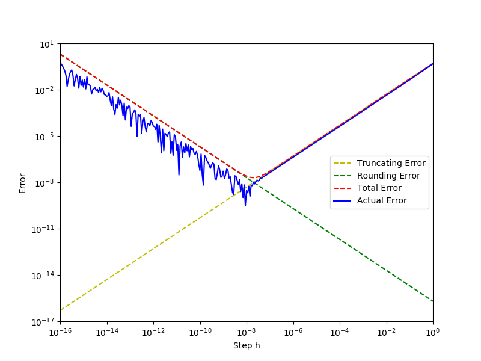
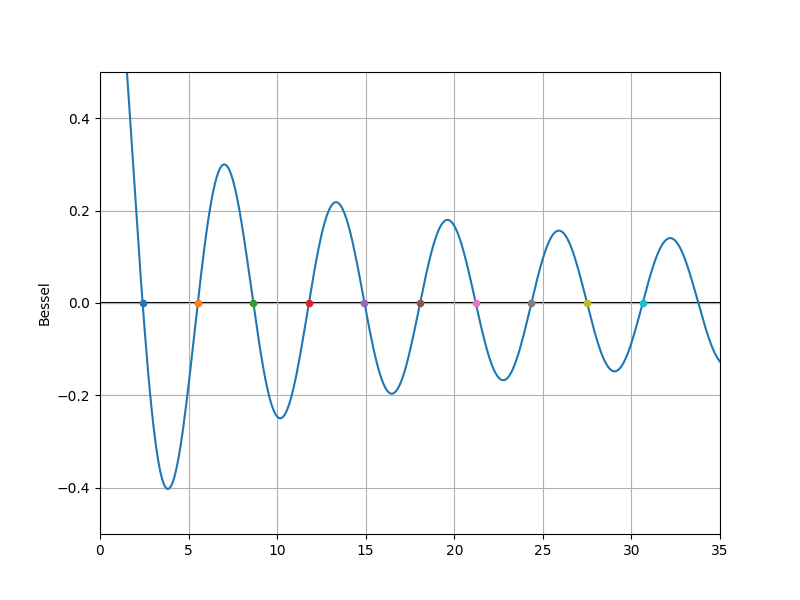
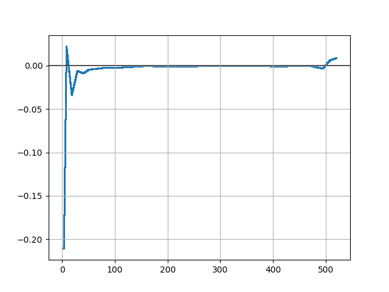

# 数值分析实验报告

> 计73 郑林楷 2017011474

我使用 python3 + numpy + scipy + matplotlib 完成以下若干实验。

## 1-1

代码可见于 `lab1/1-1.py`。

### 运行结果

采用对数坐标轴画图。



### 实现过程

设定 $\epsilon$ 为 $2^{-24}$，步长 $h$ 在对数空间上面线性取点。

画图的时候，只需要画出 $\frac{Mh}{2}$、$\frac{2\epsilon}{h}$、$\frac{Mh}{2}+\frac{2\epsilon}{h}$ 和 $|\frac{\sin(x_0+h) - \sin(x_0)}{h} - \sin'(x_0)|$，其中 $x_0=1$，分别对应图中的 `Truncation Error`、`Rounding Error`、`Total Error` 和 `Actual Error`。

### 结果分析和实验总结

可以看到截断误差随 $h$ 的增加而增加，舍入误差随 $h$ 的增加而减少，实际误差在 $h=10^{-8}$ 的时候最小，实际使用商差法时应该选取这一数值，使得误差最小。

## 1-3

代码可见于 `lab1/1-3.py`。

### 运行结果

```
Stop at n = 2097152, sum = 15.403682708740234
Theoretical value: n = 2195967
Absolute error = 0.270376013662041
Relative error = 1.787%
With float64, n will be 578556828663210
Will stop in 4.018 hours
```

### 实现过程

根据理论分析，我们可以知道当 $\frac 1n \le \frac 12 \epsilon_{\text{match}}\sum_{k-1}^{n-1}\frac 1k$ 时结果在之后的运算中将不会发生变化。

```python
n = 1
sum = np.float64(0)
eps = 6e-8

while True:
    tmp = np.float64(np.float64(1) / np.float64(n))
    if tmp <= eps * sum / 2:
        break
    sum += tmp
    n += 1
print(f'Theoretical value: n = {n}')
```

调和级数近似为 $\ln n + \gamma + \frac 1{2n}$（$\gamma$ 为欧拉常数）。如果使用双精度浮点数进行计算，则将上文中作为终止条件的不等式转化为 $\frac1n\le\frac12\epsilon_{match}(\ln n+\gamma+\frac1{2n})$ 。通过测试得知当前笔记本的浮点计算性能峰值为 80 GFLOPS。

```python
from scipy.optimize import fsolve

def f(n):
    gamma = 0.57721566490153286060651209008240243104215933593992
    return 1e-16 * (np.log(n) + gamma + 1 / (2 * n)) / 2 - 1 / n

n = int(fsolve(f, [1.])[0])
print(f'With float64, n will be {n}')
print(f'Will stop in {n * 2 / (80 * 1e9) / 3600:.3f} hours')
```

### 结果分析和实验总结

最后得到的结果「本机上计算需要 4.018 小时」只是基于理论计算，实际情况因为 CPU 性能表现不稳定等硬件因素以及非零开销抽象语言（例如 Python）自身过大的常数，都可能会让实际运行时间远比这个数值要大。

通过这次实验，我真实感受到了浮点数在不断运算积累之后所带来的误差是如此的大，所以在日常计算的时候，如果涉及到小数，要特别注意进度所带来的误差问题。

## 2-2

代码可见于 `lab2/2-2.py`。

### 运行结果

第一个函数：$x^3-x-1=0$，取 $x_0=0.6$

```
damping Newton Raphson:
Step 1: x = 1.140625, f(x) = -0.656642913818358
Step 2: x = 1.3668136615928, f(x) = 0.186639718200229
Step 3: x = 1.32627980400832, f(x) = 0.00667040146992925
Step 4: x = 1.32472022563606, f(x) = 9.67387688377563e-6
Step 5: x = 1.32471795724954, f(x) = 2.04494199351757e-11
Step 6: x = 1.32471795724475, f(x) = 2.22044604925031e-16
Step 7: x = 1.32471795724475, f(x) = 2.22044604925031e-16

basic Newton Raphson:
Step 1: x = 17.9, f(x) = 5716.43900000002
Step 2: x = 11.9468023286088, f(x) = 1692.17353280208
Step 3: x = 7.98552035193622, f(x) = 500.239416029005
Step 4: x = 5.35690931479547, f(x) = 147.367517808272
Step 5: x = 3.6249960329461, f(x) = 43.0096132035221
Step 6: x = 2.50558919010663, f(x) = 12.2244425918391
Step 7: x = 1.82012942231947, f(x) = 3.20972476461149
Step 8: x = 1.46104410988768, f(x) = 0.657773540085028
Step 9: x = 1.33932322426253, f(x) = 0.0631369611469705
Step 10: x = 1.32491286771866, f(x) = 0.000831372624715332
Step 11: x = 1.32471799263781, f(x) = 1.50938453735705e-7
Step 12: x = 1.32471795724475, f(x) = 4.88498130835069e-15
Step 13: x = 1.32471795724475, f(x) = 2.22044604925031e-16

Basic Newton Raphson: 1.32471795724475
Newton Raphson with damp: 1.32471795724475
SciPy: 1.3247179572446863
Newton error: 0.00000000%
Newton with damp error: 0.00000000%
```

第二个函数：$-x^3+5x=0$，取 $x_0=1.35$

```
damping Newton Raphson:
Step 1: x = 2.49695855614973, f(x) = -3.08324949677949
Step 2: x = 2.27197620552696, f(x) = -0.367778144156867
Step 3: x = 2.23690170575035, f(x) = -0.00834194597647553
Step 4: x = 2.23606844338361, f(x) = -4.65883963940428e-6
Step 5: x = 2.23606797749994, f(x) = -1.45838896514761e-12
Step 6: x = 2.23606797749979, f(x) = -1.77635683940025e-15
Step 7: x = 2.23606797749979, f(x) = -1.77635683940025e-15

basic Newton Raphson:
Step 1: x = 10.5256684491978, f(x) = -1113.5072686208
Step 2: x = 7.12428662558879, f(x) = -325.975011180964
Step 3: x = 4.91078065301939, f(x) = -93.8733368952927
Step 4: x = 3.51691130589217, f(x) = -25.9149417173825
Step 5: x = 2.70974300619979, f(x) = -6.34813434143222
Step 6: x = 2.33694003146878, f(x) = -1.07800405405571
Step 7: x = 2.24224425399285, f(x) = -0.0620188943055542
Step 8: x = 2.23609340302195, f(x) = -0.000254259558142067
Step 9: x = 2.23606797793343, f(x) = -4.33645297448493e-9
Step 10: x = 2.23606797749979, f(x) = -1.77635683940025e-15

Basic Newton Raphson: 2.23606797749979
Newton Raphson with damp: 2.23606797749979
SciPy: 2.236067977499786
Newton error: 0.00000000%
Newton with damp error: 0.00000000%
```

### 实现过程

$\lambda_0=1$，$\epsilon=10^{-8}$。

#### 阻尼牛顿法

迭代判停准则：$\lambda\le0$，即找不到合适的步长。

```python
def damp_Newton_Raphson(f, x):
    step = 0
    while True:
        tmp = f(x) / diff(f, x)
        lambd = 1
        while lambd > 0 and np.abs(f(x - lambd * tmp)) >= np.abs(f(x)):
            lambd /= 2
        x -= lambd * tmp
        step += 1
        print('Step {}: x = {}, f(x) = {}'.format(step, x, f(x)))
        if lambd <= 0:
            break
    return x
```

#### 基本牛顿法：

```python
def basc_Newton_Raphson(f, x):
    step = 0
    last_x = x
    while np.abs(f(x)) > eps or np.abs(x - last_x) > eps:
        last_x = x
        x -= f(x) / diff(f, x)
        step += 1
        print('Step {}: x = {}, f(x) = {}'.format(step, x, f(x)))
    return x
```

### 结果分析和实验总结

可以看到阻尼牛顿法所需要的迭代次数明显少于基本牛顿法，而且两者的误差都非常小。

通过实验我们可以很直观的感受到阻尼牛顿法的好处，使用阻尼牛顿法能够很好地解决步长过长的问题，收敛速度更加快。

## 2-3

代码可见于 `lab2/2-3.py`。

### 运行结果

$J_0(x)$ 前 10 个正的零点：

```
zeroin method took 8 steps to solve the equation: 2.40482556
zeroin method took 6 steps to solve the equation: 5.52007806
zeroin method took 5 steps to solve the equation: 8.65372792
zeroin method took 5 steps to solve the equation: 11.79153444
zeroin method took 6 steps to solve the equation: 14.93091771
zeroin method took 6 steps to solve the equation: 18.07106397
zeroin method took 5 steps to solve the equation: 21.21163663
zeroin method took 5 steps to solve the equation: 24.35247153
zeroin method took 7 steps to solve the equation: 27.49347916
zeroin method took 5 steps to solve the equation: 30.63460649
```



### 实现过程

首先按照 2.6.3 节实现 zeroin 算法，接着用其求解第一类零阶贝塞尔曲线函数 $J_0(x)$ 前 10 个正的零点，并将零点绘制在函数曲线图上。

求零点可以先通过绘制函数图象，目测出零点所在的区间，然后硬编码到代码中。

### 结果分析和实验总结

通过这次实验我学会了 Zeroin 零点迭代法。这种算法不需要导数，也可以快速地求得函数上的零点，因而是一种通用且高效的求零点算法。

## 3-6

代码可见于 `lab3/3-6.py`。

### 运行结果

```
size = 10, delta = 0
||r||_inf: 4.440892098500626e-16
||delta||_inf: 6.943372649304003e-05
size = 10, delta = 1e-07
||r||_inf: 2.220446049250313e-16
||delta||_inf: 0.00023584844566038043
size = 8, delta = 0
||r||_inf: 4.440892098500626e-16
||delta||_inf: 6.025062604386733e-08
size = 12, delta = 0
||r||_inf: 2.220446049250313e-16
||delta||_inf: 0.5521155258554964
```

### 实现过程

Hilbert 矩阵由 `scipy.linalg.hilbert` 生成。

$Hx=b \Rightarrow LL^Tx=b\Rightarrow Ly=b$，故先按照书中算法 3.10 实现 Cholesky 算法，并分解 $H$ 得到 $L$。然后先解方程 $Ly=b$，后解方程 $L^Tx=y$。 

### 结果分析和实验总结

由实验结果也可以看出，给 $b$ 微小的扰动会导致解出现极大的波动，但残差却还是极小，这说明两个解都是正确的，侧面说明 Hilbert 矩阵是病态的，其方程问题敏感性很大。

而且由后两个结果可以看出，残差随着 $n$ 的增大而增大，说明 Hilbert 矩阵的病态性随着 $n$ 的增大而严重。

## 6-2

代码可见于 `lab6/6-2.py`。

### 运行结果

```
poly:
  a: -42.60192307692302
  b: 92.92489980607627
  c: -6.005623787976729
  R^2: 0.9842815264754677
exp:
  a: 67.66323755040695
  b: 0.23809674970164715
  R^2: 0.7541461648569806
```

### 实现过程

这里采用了书上算法 6.3 实现了求解曲线拟合的最小二乘法。

根据式 (6.28) 形成矩阵 $A$ 并对其做 Householder 变换使其正交三角化，同时将变换作用于向量 $f$，最后取前 $n$ 行并求解方程 $A_1x=f_1$ 得到 $x$。

### 结果分析

从结果可以看出二次多项式函数拟合的相关系数 $R^2$ 要比指数函数拟合的相关系数 $R^2$ 高出不少，说明二次多项式函数的拟合效果更好。

## 6-8

代码可见于 `lab6/6-8.py`。

### 运行结果

| $x$  | $f(x)$     | $f'(x)$    | $f''(x)$   |
| ---- | ---------- | ---------- | ---------- |
| 2    | 7.8182664  | 1.5537885  | -0.2106237 |
| 30   | 25.3791650 | 0.3510325  | -0.0059134 |
| 130  | 37.1532706 | -0.0091734 | -0.0011981 |
| 350  | 22.4686084 | -0.1076115 | -0.0001972 |
| 515  | 0.5412492  | -0.0895035 | 0.0081490  |


### 实现过程

这里采用了书上算法 6.5 实现了用满足第一种边界条件的三次样条插值计算函数值。

首先用算法 3.12 追赶法求解线性方程组 (6.79)，得到 $M_0, M_1...M_n$；然后判断 $x$ 所属的插值结点区间 $j$，根据： 
$$
S(x)=\frac{M_j\frac{(x_{j+1}-x)^3}{6}+M_{j+1}\frac{(x-x_j)^3}{6}+\left(f_j-\frac{M_jh_j^2}6\right)\left(x_{j+1}-x\right)+\left(f_{j+1}-
\frac{M_{j+1}h_j^2}6\right)\left(x-x_j\right)}{h_j}
$$
算出 $y=S(x)$。

### 结果分析

从结果上看，求出的三次样条插值函数基本反映了数据的大致分布规律，采样点也都落在曲线上。同时输出其二阶导数图：



可以看出三次样条插值函数的二阶导数是连续的。